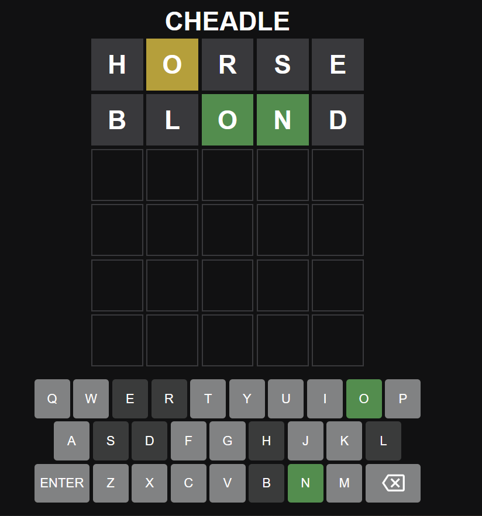

# Cheadle (Wordle Variant)

Thanks to https://github.com/wissamfawaz/wordle-clone for providing the base code.

## Running Locally

To play, simply download the repository and open the html file in your preferred web browser.

## Instructions

You have 6 attempts to guess Don Cheadle's word of the day.

Each guess consists of 5 letters. After providing a guess, press the enter key. Each guess must be recognized as a valid dictionary word.

## Color Codes of Letters

In each guess you supply, a correct letter with a position matching its spot in the correct answer will be colored in green.

A correct letter in the wrong spot is colored in yellow.

Last but least, an incorrect letter will be colored in gray.

## Game Preview

